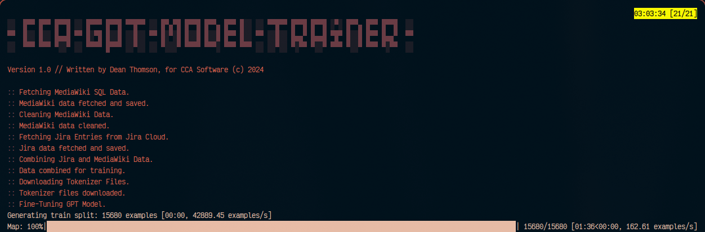

<p align="center">
  
</p>

```markdown
# CCA GPT Model Trainer

This repository contains a script created specifically for my employer, designed with MediaWiki and Jira Cloud in mind. The tool automates the process of fetching, cleaning, and combining data from MediaWiki and Jira, and then fine-tuning a language model (GPT) on the combined dataset. Currently, all settings are hardcoded in the Python code, but I will be changing that soon. The script is optimized to handle GPU memory constraints and can switch to CPU if needed.

## Requirements

- Python 3.x
- Required Python packages (install using `pip install -r requirements.txt`):
  - art
  - colorama
  - MySQLdb
  - beautifulsoup4
  - requests
  - transformers
  - torch
  - datasets

## Usage

1. **Clone the repository**:
   ```bash
   git clone https://github.com/yourusername/cca-gpt-model-trainer.git
   cd cca-gpt-model-trainer
   ```

2. **Install dependencies**:
   ```bash
   pip install -r requirements.txt
   ```

3. **Update settings in the script**:
   
   Open the `cca-gpt-model-trainer.py` script and update the following settings:

   - **MySQL Database Connection**:
     ```python
     connection = MySQLdb.connect(
         host="localhost", user="grahf", password="<password>", database="local_wiki"
     )
     ```
     Change `host`, `user`, `password`, and `database` to match your MediaWiki database credentials.

   - **Jira API Connection**:
     ```python
     url = "https://site.atlassian.net/rest/api/3/search"  # CHANGE THIS TO APPROPRIATE JIRA URL
     params = {
         "jql": "project = CSS",  # CHANGE THIS TO APPROPRIATE PROJECT CODE
         "maxResults": 3000,
         "fields": "summary,description,comment",
     }

     email = "email@email.com"  # CHANGE THIS TO APPROPRIATE JIRA USER
     api_token = "<token>"  # ADD JIRA TOKEN
     ```
     Change the `url`, `params['jql']`, `email`, and `api_token` to match your Jira Cloud instance and credentials.

4. **Run the script**:
   ```bash
   python cca-gpt-model-trainer.py
   ```

## Script Functions

- `fetch_mediawiki_data()`: Fetches MediaWiki data and saves it to a text file. Ensure you update the database connection settings.
- `clean_mediawiki_data()`: Cleans the MediaWiki data by removing HTML tags and other unnecessary content.
- `fetch_jira_data()`: Fetches Jira entries using the Jira REST API and saves them to a JSON file. Ensure you update the Jira connection settings.
- `combine_files(jira_file, mediawiki_file, combined_file)`: Combines Jira and MediaWiki data into a single text file for training.
- `download_tokenizer_files(model_name, output_dir)`: Downloads the tokenizer files for the specified model.
- `fine_tune_gpt_model(data_file, output_dir)`: Fine-tunes a GPT model on the combined data.

## Future Improvements

- Externalize settings to a configuration file to avoid hardcoding values in the script.
- Add logging for better traceability and debugging.
- Improve error handling and retry mechanisms.

## License

This project is licensed under the MIT License - see the [LICENSE](LICENSE) file for details.

## Author

- Dean Thomson (grahfmusic) - [GitHub](https://github.com/grahfmusic)
```
